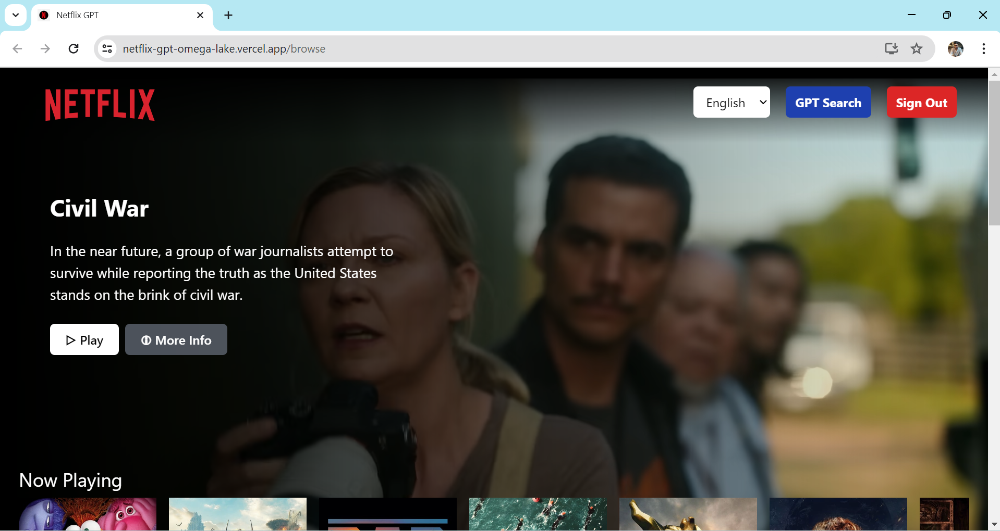
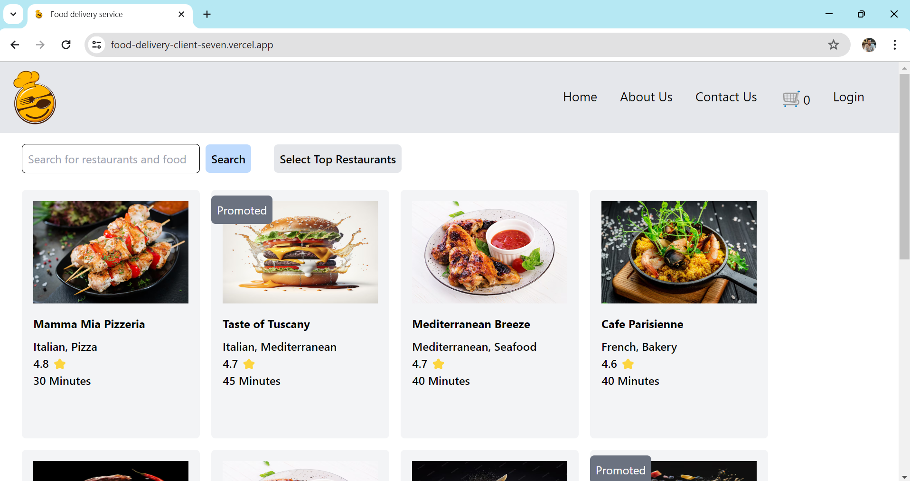

# Hi there, I'm Iqbal Hossain 👋

## 👨‍💻 About Me

I am a passionate software engineer with a strong focus on full-stack web development. I enjoy solving complex problems, learning new technologies. I have the ability to learn new technology quickly.

## 🛠 Skills

### Languages

### Frameworks and Libraries

### Tools and Platforms

### Databases

### Distributed Cache

### Message Bus

## 💼 Experience

- **Software Engineer** at **Orbitax Bangladesh Limited**
  - _January 2023 - Present_
  - **Technologies:** React, Angular, ASP.NET Core, MongoDB, SQL, RabbitMQ, Redis, AWS
  - **Responsibilities:**
    - Leading a subteam to manage and enhance some products within a large-scale microservice application.
    - Mentoring junior software engineers to understand the codebase and develop production-ready services.

- **Associate Software Engineer** at **Orbitax Bangladesh Limited**
  - _May 2021 - December 2022_
  - **Technologies:** Angular, ASP.NET Core, MongoDB
  - **Responsibilities:**
    - Developed new features and resolved issues in existing features.

## 🚀 Projects

### Youtube2.0

- **Description:** A youtube like dashboard
- **Technologies:** `React`, `Redux`, `TailwindCSS`, `Youtube Data Api`
- **Link:** [Frontend](https://github.com/Bappy38/Youtube2.0)

### NetflixGPT

- **Description:** A pet project to explore
- **Technologies:** `React`, `Redux`, `TailwindCSS`, `Firebase`
- **Link:** [Frontend](https://github.com/Bappy38/Netflix-GPT)

### Food Delivery App

- **Description:** A pet project to explore
- **Technologies:** `React`, `Redux`, `TailwindCSS`, `ASP.NET Core`, `PostgreSQL`, `Vercel`, `Render`, `AWS EC2`, `AWS ECR`, `AWS EFS`, `AWS EBS`, `AWS ELB`
- **Link:** [FrontEnd](https://github.com/Bappy38/FoodDelivery-Client) [Backend](https://github.com/Bappy38/FoodDelivery-Backend)

### eShop

- **Description:** A pet project to explore microservice architecture
- **Technologies:** `ASP.NET Core`, `RabbitMQ`, `Redis`, `gRPC`, `MongoDB`, `PostgreSQL`, `Docker`
- **Link:** [Project](https://github.com/Bappy38/eShop)

## 📈 GitHub Stats

## 🏆 Problem Solving Profiles

## ✍️ Blog Posts

- [A Competitive Programming Blog](https://bappyscpworld.blogspot.com/)
